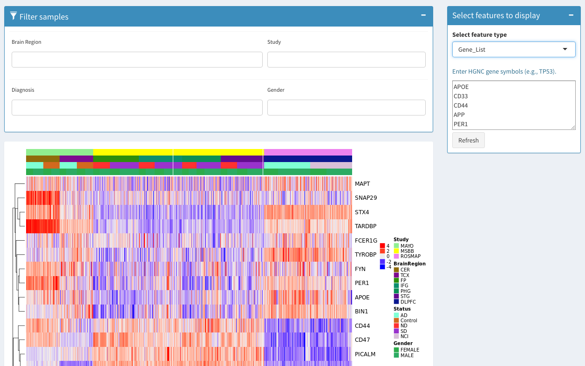

Interactive DataVis for AMP-AD Datasets hosted on [Synapse](https://www.synapse.org/#!Synapse:syn2580853/wiki/66722)
==========================

Following is an example to view expression values for the AMP-AD project, annotated by brain region, study, diagnosis, and gender. 

* Can view significant genes by FDR-adjusted p-value and log fold change.
* Can filter/select samples by metadata and gene name

##### 1. Expression with pre-populated gene list

##### 2. miRNA expression

